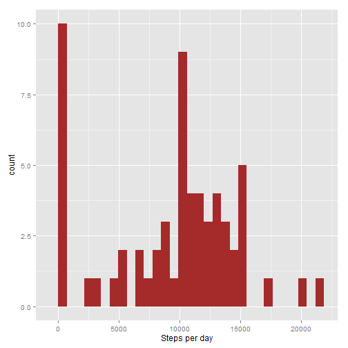
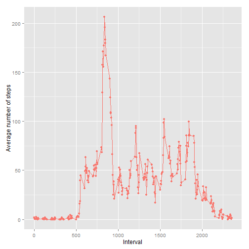
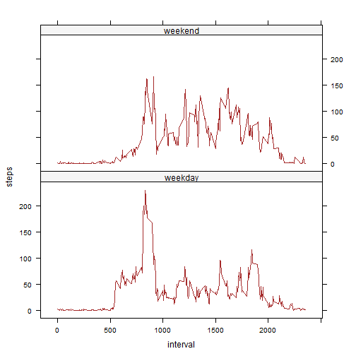

# Reproducible Research
Assigment 1
=========================================


```r
# setting options in the markdown document
library(knitr)
opts_chunk$set(echo = TRUE)
opts_chunk$set(message = F)
opts_chunk$set(warning = F)
```

This report was written to accomplish the first assignment from Coursera's
*Reproducible Research* course.

## 1. Setting options, loading required packages


```r
library(ggplot2)
library(dplyr)
library(grid)
library(magrittr)
library(lattice)
Sys.setlocale("LC_TIME", "English")
```

## 2. Reading the data


```r
url <- "https://d396qusza40orc.cloudfront.net/repdata%2Fdata%2Factivity.zip"
download.file(url, destfile = "rr1_data.zip", method="curl")
dateDownloaded <- Sys.time()
dateDownloaded
```

```
## [1] "2015-08-16 15:45:55 CEST"
```

```r
data <- read.csv(unz("rr1_data.zip", "activity.csv"))
```

## 3. What is mean total number of steps taken per day?

The first task here was to calculate the total number of steps taken per day:


```r
steps_per_day <- with(data, tapply(steps, date, sum, na.rm = T))
print(steps_per_day)
```

```
## 2012-10-01 2012-10-02 2012-10-03 2012-10-04 2012-10-05 2012-10-06 
##          0        126      11352      12116      13294      15420 
## 2012-10-07 2012-10-08 2012-10-09 2012-10-10 2012-10-11 2012-10-12 
##      11015          0      12811       9900      10304      17382 
## 2012-10-13 2012-10-14 2012-10-15 2012-10-16 2012-10-17 2012-10-18 
##      12426      15098      10139      15084      13452      10056 
## 2012-10-19 2012-10-20 2012-10-21 2012-10-22 2012-10-23 2012-10-24 
##      11829      10395       8821      13460       8918       8355 
## 2012-10-25 2012-10-26 2012-10-27 2012-10-28 2012-10-29 2012-10-30 
##       2492       6778      10119      11458       5018       9819 
## 2012-10-31 2012-11-01 2012-11-02 2012-11-03 2012-11-04 2012-11-05 
##      15414          0      10600      10571          0      10439 
## 2012-11-06 2012-11-07 2012-11-08 2012-11-09 2012-11-10 2012-11-11 
##       8334      12883       3219          0          0      12608 
## 2012-11-12 2012-11-13 2012-11-14 2012-11-15 2012-11-16 2012-11-17 
##      10765       7336          0         41       5441      14339 
## 2012-11-18 2012-11-19 2012-11-20 2012-11-21 2012-11-22 2012-11-23 
##      15110       8841       4472      12787      20427      21194 
## 2012-11-24 2012-11-25 2012-11-26 2012-11-27 2012-11-28 2012-11-29 
##      14478      11834      11162      13646      10183       7047 
## 2012-11-30 
##          0
```

Secondly, the histogram of the total number of steps taken each day was plotted:


```r
qplot(steps_per_day, geom = "histogram",
      xlab = "Steps per day") + geom_bar(fill = "brown")
```

 

Thirdly, mean and median  of the total number of steps taken per day were reported:


```r
mm <- data.frame(mean(steps_per_day), median(steps_per_day))
colnames(mm) <- c("mean", "median")
print(mm, row.names = FALSE)
```

```
##     mean median
##  9354.23  10395
```

## 4. What is the average daily activity pattern?

Here a time-series plot of the 5-minute interval and the average number of steps taken, averaged across all days was obtained:


```r
# data preparation
steps_per_interval <- with(data, tapply(steps, interval, mean, na.rm = T))

# plot
plot3 <- qplot(as.numeric(rownames(steps_per_interval)), steps_per_interval,
      colour = "brown")
plot3 <- plot3 + theme(legend.position = "none")
plot3 <- plot3 + geom_line()
plot3 <- plot3 + xlab("Interval") + ylab("Average number of steps")
plot3
```

 

What is more, an average 5-minute interval containing the maximum number of steps
was derived:


```r
names(steps_per_interval[match(max(steps_per_interval), steps_per_interval)])
```

```
## [1] "835"
```

## 5. Imputing missing values

First of all, the total number of missing values in the given dataset was calculated:


```r
sum(is.na(data))
```

```
## [1] 2304
```

Next, the NAs were filled by taking the means of the 5-minute intervals. The new
dataset was saved as *data2*.


```r
data2 <- data

for (i in 1:length(data$steps)) {
  if(is.na(data$steps[i])){
    data2$steps[i] <- mean(data$steps[data$interval == data$interval[i]], na.rm = T)
  }
}
```

A new histogram of the total number of steps taken each day was created as well:


```r
# data preparation
steps_per_day2 <- with(data2, tapply(steps, date, sum, na.rm = T))

# histogram
qplot(steps_per_day, geom = "histogram",
      xlab = "Steps per day") + geom_bar(fill = "brown")
```

 


New mean and median  of the total number of steps taken per day were also reported:


```r
mm2 <- data.frame(mean(steps_per_day2), median(steps_per_day2))
colnames(mm2) <- c("mean", "median")
print(mm2, row.names = FALSE)
```

```
##      mean   median
##  10766.19 10766.19
```

The obtained values are different from those in the first part. Imputing missings
using means by intervals improved the mean and median values of total daily numbers
of steps.

## 6. Are there differences in activity patterns between weekdays and weekends?

Firstly, a new variable in the dataset with two levels – “weekday” and “weekend” indicating whether a given date is a weekday or weekend day was created
(it was assumed that a weekend contains Saturday and Sunday):


```r
data2$day <- weekdays(strptime(data2$date, "%Y-%m-%d"))
data2$weekend <- ifelse(data2$day %in% c("Saturday", "Sunday"), "weekend", "weekday")
```

Next, some data transformations were needed in order to obtain a plot by using the
lattice system.


```r
weekday <- 
  data2 %>% subset(weekend == "weekday") %>% with(tapply(steps, interval, mean))

weekend <- 
  data2 %>% subset(weekend == "weekend") %>% with(tapply(steps, interval, mean))

weekday <- data.frame(weekday, as.numeric(rownames(weekday)), "weekday")
weekend <- data.frame(weekend, as.numeric(rownames(weekend)), "weekend")

colnames(weekend) <- c("steps", "interval", "weekend")
colnames(weekday) <- c("steps", "interval", "weekend")

data3 <- rbind(weekday, weekend)
```

Finally, the panel plot containing a time series plot of the 5-minute interval 
(x-axis) and the average number of steps taken, averaged across all weekday days or weekend days (y-axis) was created:


```r
xyplot(steps ~ interval | weekend, data = data3, layout = c(1, 2), type = "l",
       col = "brown",
       par.settings = list(strip.background = list(col = "whitesmoke")))
```

 
